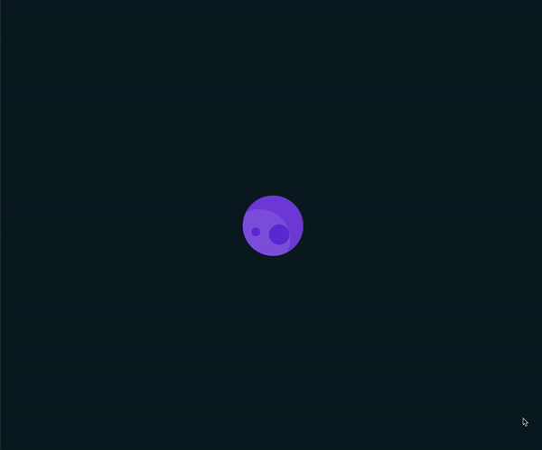

# 🌍 Planet Spinner

This project features an animated spinning planet with an orbiting moon, showcasing intricate CSS animations and transitions.

## 📦 Technologies

Built with:

- `HTML:` Markup language for creating the structure.
- `CSS:` For styling and animations.

## ⚙️ Getting Started

To view and interact with the Planet Spinner animation:

1. Download the project files.
2. Open the `index.html` file in Visual Studio Code.
3. Use the Live Server extension in VS Code to view the project in your web browser.

## 🖱️ Interaction

Open the project in your browser to see the animated spinning planet with an orbiting moon.

## 🛣️ Project Structure

Here are the key files and their purposes:

- **index.html**: The main HTML file containing the structure of the Planet Spinner animation.
- **style.css**: The CSS file that styles the planet and moon and adds animations.

Feel free to explore and customize these files to suit your needs!

## 📱 Responsive Design

- The Planet Spinner animation is responsive, ensuring a seamless experience on both desktops and mobile devices.

## 🔄 Animations

The Planet Spinner animation includes various CSS animations and transitions. Here’s an overview:

- **Planet Rotation**: The planet rotates smoothly, creating a continuous spinning effect.
- **Moon Orbit**: The moon orbits around the planet, adding a dynamic element to the animation.
